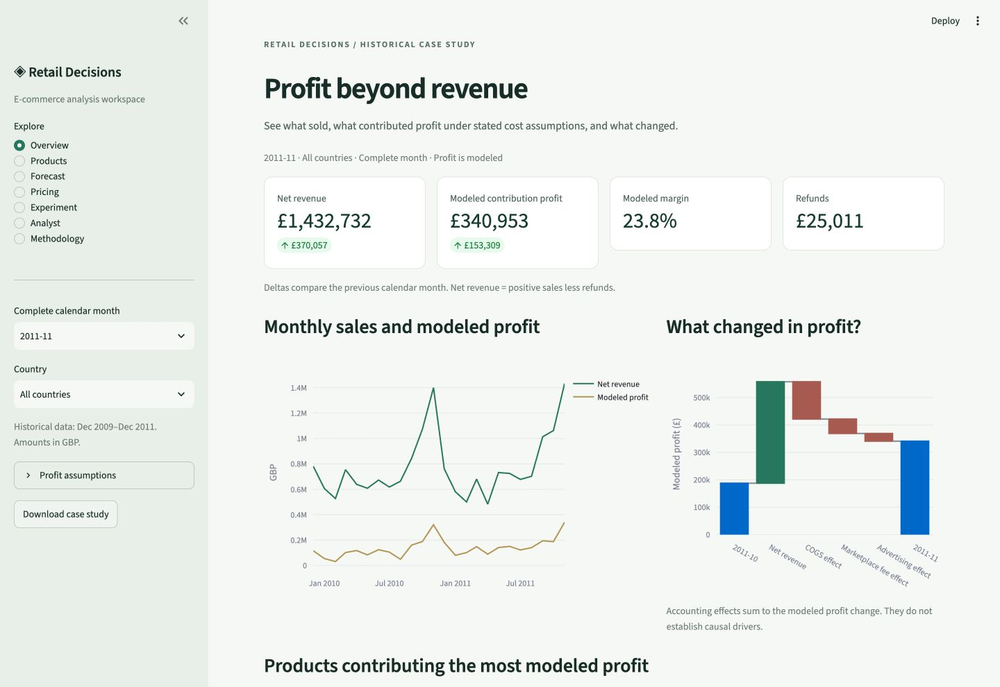
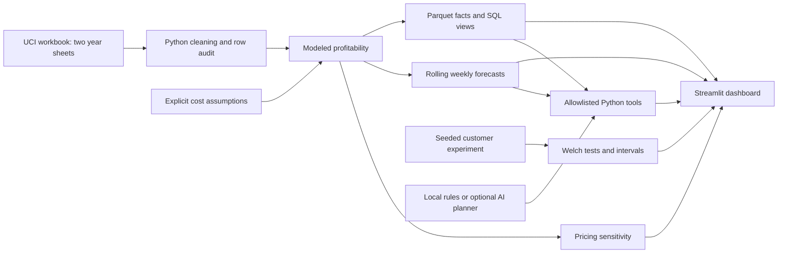

# E-commerce Profitability & Forecasting System

A working local portfolio case study with an interactive Streamlit dashboard, reproducible data pipeline, SQL analysis, weekly forecasting, pricing sensitivity, a simulated experiment, and a free deterministic business-analysis assistant. The default app requires no paid API, Power BI, or Docker. Streamlit is the dashboard for the Mac-compatible project. The local analyst uses rules and Python calculations, not GenAI.



## What is included

- **Overview:** observed revenue, modeled profit/margin, monthly trend, and reconciled accounting bridge.
- **Products:** profitability ranking, returns, declining sold units, and auditable promotion screening.
- **Forecast:** aggregate and top-product four-week forecasts, baseline comparisons, rolling validation, separate test scores, and empirical error ranges.
- **Pricing:** interactive price, elasticity, and advertising-budget scenarios, with unit costs fixed.
- **Experiment:** sample-size calculator, proposed experiment protocol, and seeded customer-level simulation.
- **Analyst:** business questions routed to allowlisted Python functions. No LLM is needed for local mode; live AI is an optional planner only.
- **Methodology:** source reconciliation, observed versus assumed inputs, period boundaries, and limitations.

## Open the finished local app

The included processed data and reports are ready to use. On the original Mac workspace, double-click `start.command`, or visit the running local preview at http://127.0.0.1:8501. The preview is available only while the local server remains running.

On another computer, install Python 3.12, open a terminal in this project folder, and run:

```sh
python3 -m venv .venv
source .venv/bin/activate
python -m pip install -r requirements.txt
python -m streamlit run app.py
```

Windows activation: `.venv\Scripts\activate` instead of `source .venv/bin/activate`.

## Results from the executed dataset

- Source: **1,067,371** lines across both workbook sheets.
- Cross-sheet overlap: **22,523** repeated snapshot lines removed while retaining within-sheet multiplicity.
- Modeled merchandise: **1,032,897** lines, with exclusions separately reconciled.
- Modeled-scope observed net revenue: **£18,980,392.51**.
- Illustrative contribution profit: **£3,368,752.40** under the documented cost scenario.
- Validation-selected aggregate model: **Seasonal ridge**, with **17.1%** test WAPE.
- Recent four-week mean baseline: **12.2%** test WAPE. The selected model did not outperform this baseline on the test set; both results are retained.

This is historical 2009–2011 data. The forecast begins December 5, 2011. It is not a forecast for today. Costs, fees, advertising, elasticity, and experiment data are explicitly assumed/simulated. No measured profit improvement or real A/B trial is claimed.

## Rebuild from the original source

The full download bundle includes the original workbook. A source-only checkout can retrieve it automatically:

```sh
python src/download_data.py
python src/build_project.py
```

For a faster repeat build after the workbook has been extracted:

```sh
python src/build_project.py --input data/raw/source_cache.parquet
```

`assumptions.json` owns the accounting assumptions. Changing it requires rebuilding the reports, processed data, and SQL demo. The dashboard cache refreshes when the build manifest changes; reload the page after rebuilding. Pricing sliders change the selected scenario interactively without altering baseline history.

The default build exports the portable SQLite database to `data/processed/retail.sqlite`; it is excluded from source control because of its size. Reports and processed transaction data are included for an immediately usable dashboard.

## SQL and PostgreSQL

`sql/business_queries.sql` answers product and monthly business questions. Python and SQLite totals were reconciled on the full dataset.

On the original Mac, initialize Postgres.app and double-click `connect_postgres.command` to load and verify the local database. Approve its Python connection prompt if asked. The loader checks row counts, nine financial totals, and monthly/product SQL views.

To load the same facts into an existing PostgreSQL database, set `DATABASE_URL` securely in your environment, then run:

```sh
python src/load_postgres.py
```

The loader creates a dedicated `retail_portfolio` schema, refreshes its `fact_sales` table in a transaction, bulk loads facts, creates views, and reconciles total profit. Re-running the loader replaces the project table; do not point it at a schema containing unrelated data.

The dashboard Compose file runs independently. Add the optional PostgreSQL service with `docker compose -f compose.yaml -f compose.postgres.yaml up --build`. Set a nonempty `POSTGRES_PASSWORD` first; the database configuration requires it. PostgreSQL was loaded and verified on the local Postgres.app 18.6 server: 1,032,897 rows, nine financial totals, and monthly/product SQL views reconcile to Python. A repeat refresh was also verified. See `reports/postgres_verification.json`. SQLite remains the portable backend.

## Optional live AI

This optional extension is outside the free project scope and is disabled in the dashboard by default, even when a key has been saved. OpenAI API usage costs money; creating a key does not include credits. Only explicitly enable it by setting `ENABLE_LIVE_AI=true` in the server environment if you choose to fund and validate it later. The free local analyst needs no credentials.

For optional local configuration on a Mac, `configure_ai.command` opens a private key-entry popup and saves owner-only settings. For hosting, use the provider's secrets settings. Never commit API keys or paste them into chat.

The adapter uses the [OpenAI Responses API function-calling workflow](https://developers.openai.com/api/docs/guides/function-calling): a strict structured call selects an allowlisted analysis with validated arguments. Python executes the tool and renders the answer. LLM-generated financial prose is not displayed. No arbitrary SQL or executable code from the model is run.

The API adapter was tested with a mock response, not a live paid request. Once securely configured, run `python src/verify_live_ai.py` for five live routing/calculation checks (these make paid API requests). Local rules mode is deliberately labelled as no LLM. Unsupported questions and missing periods return explicit messages rather than invented results.

## Validation

```sh
python -m pip install -r requirements-dev.txt
python -m pytest tests -q
```

The 53-test suite covers private settings, Power BI export totals and report field bindings, financial identity, returns and refunds, missing/invalid fields, row partitioning, constant forecasts, model-selection isolation from test outcomes, price/advertising scenarios, SQL reconciliation, seeded experimentation, invalid planner calls, missing periods, and all seven dashboard pages. Controls are exercised to confirm that results update.

## Deploy

A Dockerfile and Compose configuration are included. Docker was not available here, so container build/deployment remains unverified.

For public hosting, push the source package to your chosen GitHub repository, then deploy `app.py` with Python 3.12 on Streamlit Community Cloud. Keep the processed transaction file and summary reports in the repository; exclude raw workbook/cache, SQLite database, `.env`, and `.streamlit/secrets.toml`. No public deployment has been made yet. See `docs/DEPLOYMENT.md` for the exact handoff.

## Portfolio material

- `docs/CASE_STUDY.md`: executed findings, methodology, and business interpretation.
- `docs/METRICS.md`: metric definitions, source grain, assumptions, and forecast design.
- `docs/EXPERIMENT_PROTOCOL.md`: a prespecified real-world test plan and simulation settings.
- `docs/DEMO_AND_INTERVIEW.md`: demo flow, interview answers, and evidence-based resume wording.
- `assets/`: actual dashboard screenshots.
- `reports/`: CSV exports, quality report, forecast scores, experiment results, and source/build provenance.
- `powerbi/Retail.pbip`: optional authored four-page Power BI report, excluded from the chosen Mac project scope. Its JSON schemas pass; Desktop refresh/render validation remains unverified. Streamlit supplies the working dashboard.

## Architecture



## Source and attribution

Chen, D. (2012). *Online Retail II* [Dataset]. UCI Machine Learning Repository. https://doi.org/10.24432/C5CG6D. [Dataset page](https://archive.ics.uci.edu/dataset/502/online+retail+ii). CC BY 4.0. The original workbook is preserved; processing/exclusions and synthetic additions are documented above. There is no connection to SHOEGR company data.
